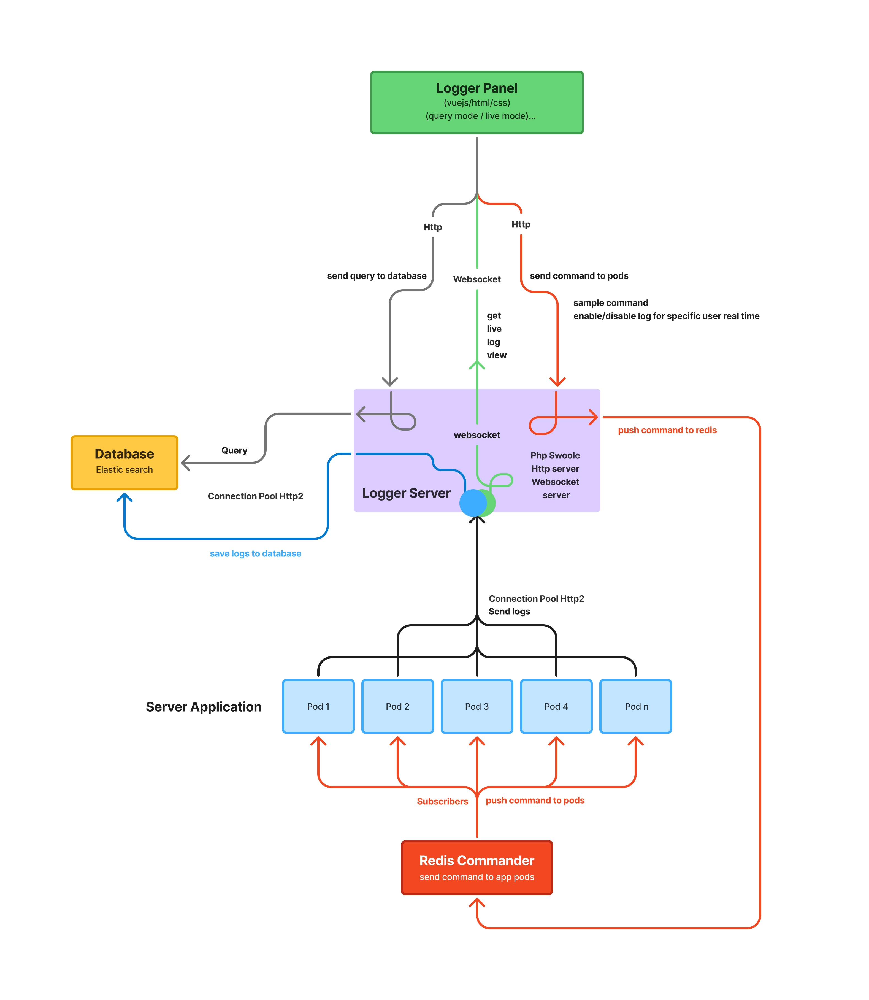

A **distributed real-time logging system** built for microservice environments, combining performance, flexibility, and developer-friendly control.
It allows developers to **collect, monitor, and query logs in real time**. It is designed for distributed systems and integrates with modern infrastructures using **PHP Swoole**, **Redis**, and **Elasticsearch**.

## Architecture

## Components

### Logger Panel
- Built with **Vue.js**
- Two modes:
    - **Query Mode** – search and filter logs
    - **Live Mode** – real-time log streaming
- Allows enabling/disabling logs for specific users or connection types

### Logger Server
- Powered by **PHP Swoole**
- Handles both HTTP and WebSocket connections
- Manages communication between the database, Redis, and frontend panel
- Pushes and receives log data in real time

### Redis Commander
- Publishes commands to **Pods** via Redis channels
- Supports runtime configuration updates and selective log control

### Database (Elasticsearch)
- Stores and indexes logs
- Provides fast and powerful log search queries

### Pods (Server Applications)
- Application containers or instances that generate logs
- Subscribe to Redis channels to receive commands from Logger Server

## Features

- **Real-time log streaming** with WebSocket
- **Advanced search** powered by Elasticsearch
- **Command-based log control** (enable/disable logs dynamically)
- **Scalable architecture** for multi-instance environments
- **Modern dashboard** built with Vue.js
- **Built for developers**, with simple integration and flexible APIs

## 🛠️ Tech Stack

| Component        | Technology Used      |
|------------------|----------------------|
| Backend Server   | PHP + Swoole         |
| Realtime Channel | WebSocket            |
| Message Broker   | Redis                |
| Database         | Elasticsearch        |
| Frontend Panel   | Vue.js               |
| Infrastructure   | Microservices (Pods) |

## Installation (coming soon)

Installation and integration guides will be added soon.  
Stay tuned for setup instructions, Docker images, and API documentation.

## 🧾 License

Released under the **MIT License**.  
© 2025 All rights reserved.
